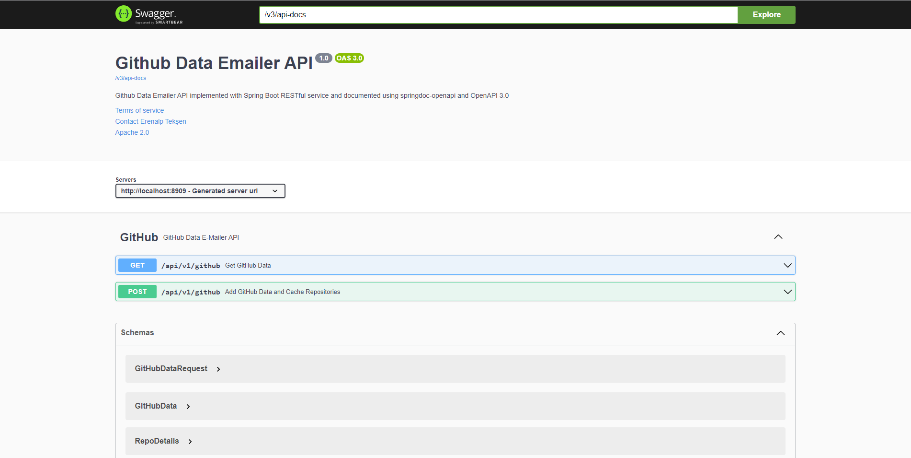
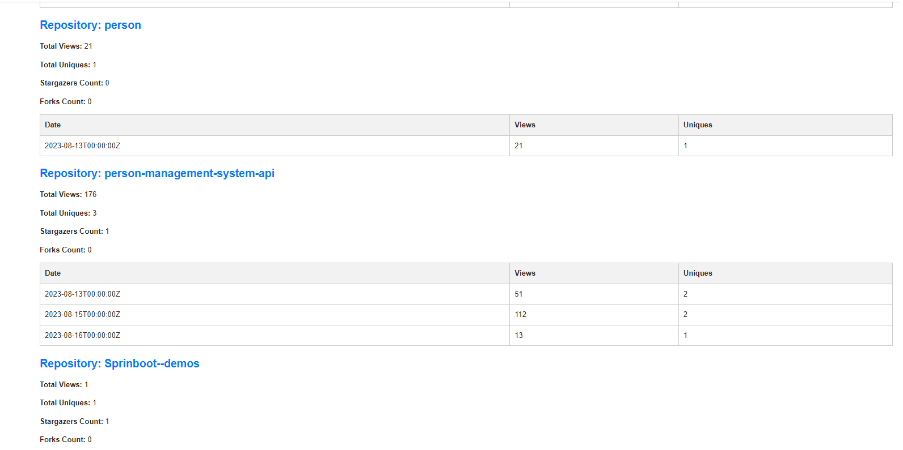

# GitHub Data Emailer


[](https://www.linkedin.com/in/erenalp-teksen/)


## Description

GitHub Repo Analyzer is a Spring Boot application that allows users to send a POST request to an endpoint with their GitHub username,
GitHub API key, and an email address. The application retrieves all repositories of the specified username using the GitHub API,
records statistics such as stars, forks, and interactions, and sends scheduled email reports to the user at specified intervals.

## Table of Contents

- [Requirements](#requirements)
- [Installation](#installation)
- [Deployment](#deployment)
- [Viewing Results](#viewing-results)
- [Contributing](#contributing)
- [License](#license)
- [Contact](#contact)

  ## Requirements ##

  To run this project, you will need the following:
  
  - **Mail Server** You need an email server to send scheduled reports. You can choose between the following options:
    - **Mail Gun SMTP** (I prefer Mailgun)
    - **SendGrid SMTP**
    - **Gmail SMTP**
    - **Yahoo Mail SMTP**
    - **Zoho Mail SMTP**

  - **Java 8 or higher**
  - **Docker** (optional, for containerization of the project)
 
  ## Installation ##

  1. Clone the repository to your local machine:
 
  ```sh
   git clone https://github.com/Erenalp06/github-data-emailer.git
   cd your-repo
  ```
  
  2. **Configuration:** Open the `.yaml` extension file and make the necessary changes: <br>
  [Click here to view the application.properties file](/src/main/resources/application.yaml)

  ```yaml
  server:
    port: 8909
  
  Mail server
  spring:
    mail:
      host: <HOST_NAME> # smtp.gmail.com, smtp.yandex.com, smtp.live.com, smtp.mail.yahoo.com, smtp.mailgun.org, smtp.zoho.com
      port: <PORT> # 587, 465
      username: <YOUR_MAIL_SERVER_USERNAME>
      password: <YOUR_MAIL_SERVER_PASSWORD>
      properties:
        mail:
          smtp:
            auth: true
            starttls:
              enable: true
              required: true
  
  Schedule task
  scheduled:
    task:
      initial-delay: 60000 # Initial delay: Specifies the time after which the task will be first executed, in milliseconds. For example, 300000 milliseconds corresponds to 5 minutes.
      fixed-delay: 300000 # Fixed delay: Specifies the time interval between the completion of one execution and the start of the next, in milliseconds. For example, 3600000 milliseconds corresponds to 1 hour.
      time-zone: Europe/Istanbul # Time zone: Specifies the time zone in which the cron expression will be resolved. For example, "America/New_York" or "GMT+10".
  ```
- Set your mail server's host, port, username, and password as per your mail server information.
- Adjust the initial-delay and fixed-delay values for the scheduled task according to your preferences.
- Modify the time-zone field to set the time zone in which the cron expressions will be resolved. For example, you can use "America/New_York" or "GMT+10".

3. Install the required dependencies by running:

    ```sh
    mvn install
    ```

## Deployment ##

- Build the Docker image and run the application as a container:

  ```sh
  // docker build
  docker build -t github-data-emailer:1.0 .
  ```

  ```bash
  // docker run
  docker run -d -p 8909:8909 --name github-data-emailer-app github-data-emailer:1.0
  ```

- Access the application by navigating to http://localhost:8909 in your web browser.

## Swagger ##

The application provides a Swagger UI interface for exploring the API documentation and endpoints. Follow these steps to access the Swagger documentation:

1. Ensure that the application is up and running. If you haven't deployed it yet, refer to the [Deployment](#deployment) section.

2. Open your web browser and navigate to: http://localhost:8909/swagger-ui.html <br>
This URL will take you to the Swagger UI, where you can view and interact with the available API endpoints.

3. Explore the endpoints, make API requests, and view the responses directly in the Swagger UI.




## Viewing Results ##

After setting up and deploying the application, you will receive email notifications containing the GitHub repository statistics you've requested. Here's an example of how an email might look:



## Contributing ##

Contributions are welcome! For significant changes, please open an issue to discuss first.

  1. Fork this repository.
  2. Create a new branch (git checkout -b feature/AmazingFeature).
  3. Make changes and commit them (git commit -m 'Add some AmazingFeature').
  4. Push to your branch (git push origin feature/AmazingFeature).
  5. Open a Pull Request.

## License ##

This project is licensed under the MIT License - see the [LICENSE](LICENSE) file for details.<br>
Developer: Erenalp TEKŞEN <br>
Project Link: https://github.com/Erenalp06/github-data-emailer

## Explore Rest API ##

The app defines following CRUP APIs.

### GitHubData

| Method | URL              | Description                                       | Sample Valid Request Body |
| ------ | ---------------- | ------------------------------------------------- | ------------------------- |
| GET    | /api/v1/github   | Get GitHub data for the specified user.           |                           |
| POST   | /api/v1/github   | Create a new user and analyze their repositories  | [JSON](#githubdatacreate) |

## API Endpoints

### POST /api/v1/github

**Description:** Create User and Analyze Repositories

This endpoint facilitates the creation of a new user and triggers the analysis of their GitHub repositories. The analysis encompasses various statistics, such as stars, forks, and interactions. Upon completion of the analysis, an email notification will be sent to the user.

**Request:**

- Method: POST
- Content-Type: application/json

**Request Body:**

##### <a id="githubdatacreate">Create GitHubData -> api/v1/github</a>
```json
{
  "username": "<YOUR_USERNAME>",
  "apiKey": "<YOUR_GITHUB_API_KEY>",
  "email": "<RECIPIENT_EMAIL>"
}

  - username: The GitHub username for which the analysis will be performed.
  - apiKey: Your GitHub API key, granting necessary access for repository analysis.
  - email: The email address where the analysis results will be sent.
```

**Response:**

- Status Code: 200 OK
- Content-Type: application/json


  

    
  

  
